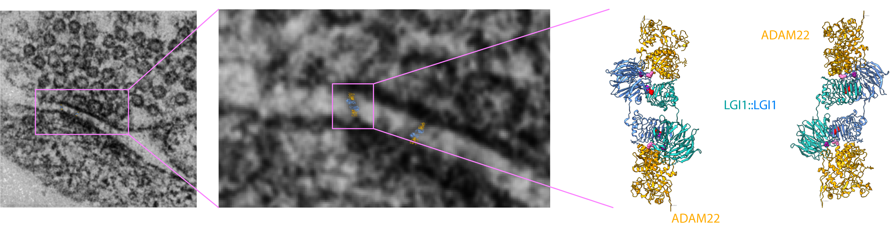

# LGI1 in Synaptic Organization, Neuronal Excitability, and Epilepsy

## Overview

LGI1 is an extracellular, secreted glycoprotein that plays a central role in synaptic organization and neuronal excitability. It forms a trans-synaptic heterotetrameric complex 
<a href="https://www.rcsb.org/structure/5Y31">PDB: 5Y31</a> 
composed of an LGI1 dimer bridging presynaptic ADAM23 and postsynaptic ADAM22 ( 
  <a href="https://pubmed.ncbi.nlm.nih.gov/16990550/">Fukata et al., 2006</a>, 
  <a href="https://pubmed.ncbi.nlm.nih.gov/29670100/">Yamagata et al., 2018</a>, 
  <a href="https://pubmed.ncbi.nlm.nih.gov/38700985/">Cuhadar et al., 2024</a> ). 
Pathogenic variants in LGI1 cause <b>Autosomal Dominant Lateral Temporal Epilepsy (ADLTE, 
  <a href="https://omim.org/entry/600512">OMIM: 600512</a> )</b>, 
also known as <b>Autosomal Dominant Partial Epilepsy with Auditory Features (ADPEAF)</b>, a focal epilepsy syndrome characterized by auditory auras, linguistic disturbances, and focal seizures often triggered by sound ( 
  <a href="https://pubmed.ncbi.nlm.nih.gov/11810107/">Kalachikov et al., 2002</a>,
  <a href="https://pubmed.ncbi.nlm.nih.gov/15079011/">Ottman et al., 2004</a> ). 
ADLTE shows high penetrance, near-complete genetic specificity for LGI1, and represents one of the clearest examples of a monogenic human focal epilepsy. Beyond genetic etiologies, autoantibodies that target LGI1 cause a common form of limbic autoimmune encephalitis (    <a href="https://pubmed.ncbi.nlm.nih.gov/20663977/">Irani et al., 2010</a> 
).
  

 

  

<b>Figure 1: LGI1 forms trans-synaptic complexes</b>. The 5y31 model has been overimposed over TEM images of a synapses but this is not real data, just a cartoon. In the right, atomic models of the heterotetrameric complex (ADAM22:LGI1:LGI1:ADAM22). ADAM22 is a transmembrane protein, but the TM domain is not resolved in PDB: 5y31. In different shades of red, the most important secretion competent mutation found in LGI1 are shown (T380A, R407C, S473L, and R474Q)

 

## LGI1 and Kv1 Potassium Channels

A key function of LGI1 is the regulation of delayed-rectifier Kv1 potassium channel complexes. LGI1 loss, whether due to genetic deficiency (<a href="https://pubmed.ncbi.nlm.nih.gov/16990550/">Chabrol et al., 2010</a>), secretion-defective mutations
( <a href="https://pubmed.ncbi.nlm.nih.gov/34967933/">Baudin et al., 2021</a> ),
secretion–competent mutations 
( <a href="https://pubmed.ncbi.nlm.nih.gov/27760137/">Dazzo et al., 2016</a> ), 
or pathogenic autoantibodies 
( <a href="https://pubmed.ncbi.nlm.nih.gov/20663977/">Irani et al., 2010</a>, 
  <a href="https://pubmed.ncbi.nlm.nih.gov/32437528/">Ramberger et al., 2020</a> 
  ), results in reduced Kv1 expression and destabilization of Kv1 channel complexes. This decrease in Kv1 conductance lowers rheobase and produces pronounced intrinsic hyperexcitability ( 
  <a href="https://pubmed.ncbi.nlm.nih.gov/28673977/">Seagar et al., 2017</a>, 
  <a href="https://pubmed.ncbi.nlm.nih.gov/37863654/">Extrémet et al., 2023</a> )
, particularly in CA3 pyramidal neurons ( 
  <a href="https://pubmed.ncbi.nlm.nih.gov/38663634/">Ramirez-Franco et al., 2024</a> 
). In contrast, PV⁺ interneurons maintain normal excitability and Kv1 content under LGI1-deficient conditions ( 
  <a href="https://pubmed.ncbi.nlm.nih.gov/29491011/">Zhou et al., 2018</a>, 
  <a href="https://pubmed.ncbi.nlm.nih.gov/38663634/">Ramirez-Franco et al., 2024</a>  
), underscoring a striking cell-type-specific requirement for LGI1.

## LGI1 and AMPA Receptor Complexes

Although early studies suggested that LGI1 organizes AMPA receptor complexes ( 
  <a href="https://pubmed.ncbi.nlm.nih.gov/16990550/">Fukata et al., 2006</a>, 
  <a href="https://pubmed.ncbi.nlm.nih.gov/26178195/">Lovero et al., 2015</a> 
), recent proteomic analyses failed to detect GluA subunits within LGI1 interactomes ( 
  <a href="https://pubmed.ncbi.nlm.nih.gov/35727946/">Ramirez-Franco et al., 2022</a> 
). Combined with inconsistent electrophysiological findings ( 
  <a href="https://pubmed.ncbi.nlm.nih.gov/20133599/">Fukata et al., 2010</a>, 
  <a href="https://pubmed.ncbi.nlm.nih.gov/26178195/">Lovero et al., 2015</a>, 
  <a href="https://pubmed.ncbi.nlm.nih.gov/30225353/">Thomas et al., 2018</a>, 
  <a href="https://pubmed.ncbi.nlm.nih.gov/20130004/">Yu et al., 2010</a>, 
  <a href="https://pubmed.ncbi.nlm.nih.gov/26878798/">Boillot et al., 2016</a>,  
  <a href="https://pubmed.ncbi.nlm.nih.gov/19701204/">Zhou et al., 2009</a>,  
  <a href="https://pubmed.ncbi.nlm.nih.gov/21054347/">Lalic et al., 2011</a>,  
  <a href="https://pubmed.ncbi.nlm.nih.gov/30346486/">Petit-Pedrol et al., 2018</a>  
), this questions whether LGI1 directly regulates AMPAR function under native conditions. Mapping LGI1 distribution has long been hindered by poor antibody specificity ( 
  <a href="https://pubmed.ncbi.nlm.nih.gov/24227725/">Ohkawa et al., 2013</a> 
), but patient-derived monoclonal antibodies ( 
  <a href="https://pubmed.ncbi.nlm.nih.gov/32437528/">Ramberger et al., 2020</a> 
) now allow precise localization at mesoscopic, subcellular, and proteomic scales ( 
  <a href="https://pubmed.ncbi.nlm.nih.gov/35727946/"> Ramirez-Franco et al., 2022</a> 
). LGI1 expression is especially high in the hippocampus, notably in the dentate gyrus (DG) and CA3 subfields (
  <a href="https://pubmed.ncbi.nlm.nih.gov/19833108/">  Herranz-Pérez et al., 2010</a>, 
  <a href="https://pubmed.ncbi.nlm.nih.gov/29520216/">  Smedfors et al., 2018</a>, 
  <a href="https://pubmed.ncbi.nlm.nih.gov/35727946/"> Ramirez-Franco et al., 2022</a>
), where it can be found at a wide range of subcellular compartments like the Axonal Initial Segment, dendrites, axon terminals, and axo-glial junctions.

## Effects of LGI1 Deficiency

LGI1 deficiency leads to reduced Kv1 channel content at the axon initial segment (AIS)—the site of action potential initiation ( 
  <a href="https://pubmed.ncbi.nlm.nih.gov/22284179/">Kole & Stuart., 2012</a> 
) —in both knockout mice ( 
  <a href="https://pubmed.ncbi.nlm.nih.gov/28673977/">Seagar et al., 2017</a> 
) and antibody-treated hippocampal slices ( 
  <a href="https://pubmed.ncbi.nlm.nih.gov/36078121/">Extrémet et al., 2022</a> 
). Infusion of pathogenic anti-LGI1 antibodies into the hippocampus induces seizures in vivo ( 
  <a href="https://pubmed.ncbi.nlm.nih.gov/39984135/">Upadhya et al., 2025</a> 
), and targeted re-expression by single-cell electroporation of LGI1 in single CA3 pyramidal neurons (in the Lgi1-/- background) restores normal excitability ( 
  <a href="https://pubmed.ncbi.nlm.nih.gov/37863654/">Extrémet et al., 2023</a> 
).

A hallmark of LGI1 deficiency is a robust bursting phenotype in CA3 pyramidal neurons ( 
  <a href="https://pubmed.ncbi.nlm.nih.gov/38663634/">Ramirez-Franco et al., 2024</a>,
  <a href="https://pubmed.ncbi.nlm.nih.gov/36804022/">Zhou et al., 2023</a>,
  <a href="https://pubmed.ncbi.nlm.nih.gov/39984135/">Upadhya et al., 2025</a> 
), characterized by increased after-depolarization (ADP) and enhanced spike clustering even at low current injections. In hippocampal neurons, bursting can arise from dendritic mechanisms involving Ca²⁺ spikes, augmented ADP, and modulation of dendritic potassium channels [Metz et al., 2007; Lazarewicz et al., 2002; Raus Balind et al., 2019]. Thus, LGI1 deficiency likely combines a lowered firing threshold (from AIS Kv1 loss) with enhanced dendritic excitability (via somatodendritic Kv1 and Ca²⁺ channel remodeling). This dual mechanism may promote the synchronous CA3 bursting that resembles interictal spikes [Traub & Wong, 1982; Xu & Clancy, 2008; Ren et al., 2021]. The high degree of recurrent connectivity in CA3 networks [Mitra et al., 2012], combined with the high sensitivity of CA3-driven interictal activity to low concentrations of 4-AP [Avoli & de Curtis, 2011], further supports this mechanistic framework.

 

  

<b>Figure 1: LGI1 defficiency increases excitability and bursting propensity through Kv1 reduction</b>. The Lgi1-/- mouse has reduced expression of Kv1.1 (top IHF pannels) and Kv1.2 (bottoom IHF) panels in the hippocampus and at the AISs of CA3 Pyramidal cells (right most panels). An increase in Intrinsic Excitability is deteected thorugh Current Clamp patch clamp in CA3 pyramidal neurons of the LGi1-/-, with a lower rheobase, higher gain during input/output curves and an increased depolarization. In the bottom rows a higher propensity for complex AP burstig is detected in the Lgi1-/- genotype. The figure is adapted from [Ramirez-Frranco et al, 2024]. The protocol in the right-most bottom panels is adapted from Raus-Balind et al., 2019.

 

## Research Approaches

We are interested in dissecting these processes using pharmacology, patch-clamp electrophysiology, Ca²⁺ imaging and high-resolution imaging techniques to define the ionic conductances underlying intrinsic hyperexcitability and network hypersynchrony in the Lgi1-/- mouse.

Importantly, Kv1 downregulation extends beyond the AIS [Ramirez-Franco et al., 2024], although accurate detection requires specialized antigen-retrieval approaches due to epitope masking in standard fixation conditions [Lorincz & Nusser, 2008; Haddjeri-Hopkins et al., 2021; Ramirez-Franco et al., 2024]. Because of this technical limitation, the contribution of dendritic Kv1 channels to LGI1-linked epilepsies and burst generation has likely been underestimated.

Although LGI1 is a secreted extracellular protein, it may regulate Kv1 channel stability by forming multimeric assemblies that limit channel internalization or degradation [Yamagata et al., 2018; Yamaguchi et al., 2025]. Recent structural data suggest a higher-order trimer-of-dimers architecture (a heterohexamer), opening new perspectives on how LGI1 organizes and stabilizes membrane protein complexes in specific neuronal domains. Despite unchanged Kv1 mRNA levels in Lgi1⁻/⁻ mice [ et al., 2017], pathological features such as Kv1.2 hyper-glycosylation have been observed [Ramirez-Franco et al., 2025], suggesting defects in channel trafficking and stabilization. Endocytosis of LGI1–antibody complexes in cell culture [Ramberger et al., 2020] further supports a role for LGI1 in stabilizing membrane protein assemblies. Given LGI1’s broad interaction network, it may act as a general extracellular scaffold that promotes the stability of membrane protein complexes. However, the precise subcellular sites of LGI1 complex assembly remain unknown. Our work aims to resolve these outstanding questions by combining advanced light and electron microscopy with pathogenic monoclonal antibodies to map LGI1 assembly, trafficking, and function with subcellular precision.

## Our contributions to understanding LGI1

<h5>Extrémet J, <b>Ramirez-Franco J</b>, Fronzaroli-Molinieres L, Boumedine-Guignon N, Ankri N, El Far O, Garrido JJ, Debanne D & Russier M (2023) Rescue of Normal Excitability in LGI1-Deficient Epileptic Neurons. J Neurosci 43: 8596–8606</h5> 
   
<h5>Ramberger M, Berretta A, Tan JMM, Sun B, Michael S, Yeo T, Theorell J, Bashford-Rogers R, Paneva S, O’Dowd V,..., <b>Ramirez-Franco J</b> et al. (2020) Distinctive binding properties of human monoclonal LGI1 autoantibodies determine pathogenic mechanisms. Brain 143: 1731–1745</h5> 
 
<h5>Ramirez-Franco J*, Debreux K*, Extremet J, Maulet Y, Belghazi M, Villard C, Sangiardi M, Youssouf F, El Far L, Lévêque C, et al. (2022) Patient-derived antibodies reveal the subcellular distribution and heterogeneous interactome of LGI1. Brain : a journal of neurology 145: 3843–3858</h5>
#Co-first authors 
   
<h5><b>Ramirez-Franco J #</b>, Debreux K, Sangiardi M, Belghazi M, Kim Y, Lee S-H, Lévêque C, Seagar M & El Far O #(2024) The downregulation of Kv1 channels in Lgi1-/-mice is accompanied by a profound modification of its interactome and a parallel decrease in Kv2 channels. Neurobiol Dis 196: 106513</h5>
#Co-corresponding authors 
   
<h5><b>Ramirez-Franco J</b>, Sangiardi M, Debreux K, Belghazi M, Lévêque C, Seagar M & Far OE (2025) A hyperglycosylated form of Kv1.2 upregulated in LGI1 knockout mice. 2025.10.29.685130 doi:10.1101/2025.10.29.685130 [PREPRINT]</h5> 

## Our Colaborators

* Oussama El Far, PhD, DR2, INSERM, Aix-Marseillé Université. Marseille, FR
* Sarosh R. Irani, B.M., B.Ch., D.Phil., Mayo Clinics. Jacksonville, FL, US
* Domique Debanne, PhD, DRCE, CNRS, Aix-Marseille Université. Marseille, FR

## References

Click to expand references

Avoli M & de Curtis M (2011) _GABAergic synchronization in the limbic system and its role in the generation of epileptiform activity_. Prog Neurobiol 95: 104–132 
Baudin P, Cousyn L & Navarro V (2022) _The LGI1 protein: molecular structure, physiological functions and disruption-related seizures_. Cell Mol Life Sci 79: 16 
Boillot M, Lee CY, Allene C, Leguern E, Baulac S & Rouach N (2016) LGI1 acts presynaptically to regulate excitatory synaptic transmission during early postnatal development. Scientific Reports 6: 1–9 
Chabrol E, Navarro V, Provenzano G, Cohen I, Dinocourt C, Rivaud-Péchoux S, Fricker D, Baulac M, Miles R, Leguern E, et al (2010) Electroclinical characterization of epileptic seizures in leucine-rich, glioma-inactivated 1-deficient mice. Brain 133: 2749–2762
Cuhadar U, Calzado-Reyes L, Pascual-Caro C, Aberra AS, Ritzau-Jost A, Aggarwal A, Ibata K, Podgorski K, Yuzaki M, Geis C, et al (2024) Activity-driven synaptic translocation of LGI1 controls excitatory neurotransmission. Cell Reports 43: 114186 
Dazzo E, Leonardi E, Belluzzi E, Malacrida S, Vitiello L, Greggio E, Tosatto SCE & Nobile C (2016) Secretion-Positive LGI1 Mutations Linked to Lateral Temporal Epilepsy Impair Binding to ADAM22 and ADAM23 Receptors. PLoS Genetics 12: 1–15 
Extrémet J, El Far O, Ankri N, Irani SR, Debanne D & Russier M (2022) An Epitope-Specific LGI1-Autoantibody Enhances Neuronal Excitability by Modulating Kv1.1 Channel. Cells 11: 2713 
Fukata Y, Adesnik H, Iwanaga T, Bredt DS, Nicoll RA & Fukata M (2006) Epilepsy-related ligand/receptor complex LGI1 and ADAM22 regulate synaptic transmission. Science 313: 1792–1795 
Fukata Y, Lovero KL, Iwanaga T, Watanabe A, Yokoi N, Tabuchi K, Shigemoto R, Nicoll RA & Fukata M (2010) Disruption of LGI1-linked synaptic complex causes abnormal synaptic transmission and epilepsy. Proceedings of the National Academy of Sciences 107: 3799–3804 
Haddjeri-Hopkins A, Tapia M, Ramirez-Franco J, Tell F, Marqueze-Pouey B, Amalric M & Goaillard JM (2021) Refining the Identity and Role of Kv4 Channels in Mouse Substantia Nigra Dopaminergic Neurons. eNeuro 8 
Herranz-Pérez V, Olucha-Bordonau FE, Morante-Redolat JM & Pérez-Tur J (2010) Regional distribution of the leucine-rich glioma inactivated (LGI) gene family transcripts in the adult mouse brain. Brain Research 1307: 177–194 
Irani SR, Alexander S, Waters P, Kleopa KA, Pettingill P, Zuliani L, Peles E, Buckley C, Lang B & Vincent A (2010) Antibodies to Kv1 potassium channel-complex proteins leucine-rich, glioma inactivated 1 protein and contactin-associated protein-2 in limbic encephalitis, Morvan’s syndrome and acquired neuromyotonia. Brain 133: 2734–2748 
Kalachikov S, Evgrafov O, Ross B, Winawer M, Barker-Cummings C, Boneschi FM, Choi C, Morozov P, Das K, Teplitskaya E, et al (2002) Mutations in LGI1 cause autosomal-dominant partial epilepsy with auditory features. Nature Genetics 30: 335–341 
Kole MHP & Stuart GJ (2012) Signal Processing in the Axon Initial Segment. Neuron 73: 235–247 
Lalic T, Pettingill P, Vincent A & Capogna M (2011) Human limbic encephalitis serum enhances hippocampal mossy fiber-CA3 pyramidal cell synaptic transmission. Epilepsia 52: 121–131 
Lazarewicz MT, Migliore M & Ascoli GA (2002) A new bursting model of CA3 pyramidal cell physiology suggests multiple locations for spike initiation. BioSystems 67: 129–137 
Lorincz A & Nusser Z (2008) Cell-Type-Dependent Molecular Composition of the Axon Initial Segment. Journal of Neuroscience 28: 14329–14340 
Lovero KL, Fukata Y, Granger AJ, Fukata M & Nicoll RA (2015) The LGI1–ADAM22 protein complex directs synapse maturation through regulation of PSD-95 function. Proceedings of the National Academy of Sciences 112: E4129–E4137 
Metz AE, Spruston N & Martina M (2007) Dendritic D-type potassium currents inhibit the spike afterdepolarization in rat hippocampal CA1 pyramidal neurons. Journal of Physiology 581: 175–187 
Mitra A, Mitra SS & Tsien RW (2012) Heterogeneous reallocation of presynaptic efficacy in recurrent excitatory circuits adapting to inactivity. Nature Neuroscience 15: 250–257 
Ohkawa T, Fukata Y, Yamasaki M, Miyazaki T, Yokoi N, Takashima H, Watanabe M, Watanabe O & Fukata M (2013) Autoantibodies to Epilepsy-Related LGI1 in Limbic Encephalitis Neutralize LGI1-ADAM22 Interaction and Reduce Synaptic AMPA Receptors. Journal of Neuroscience 33: 18161–18174 
Ottman R, Winawer MR, Kalachikov S, Barker-Cummings C, Gilliam TC, Pedley TA & Hauser WA (2004) LGI1 mutations in autosomal dominant partial epilepsy with auditory features. Neurology 62: 1120–1126 
Petit-Pedrol M, Sell J, Planagumà J, Mannara F, Radosevic M, Haselmann H, Ceanga M, Sabater L, Spatola M, Soto D, et al (2018) LGI1 antibodies alter Kv1.1 and AMPA receptors changing synaptic excitability, plasticity and memory. Brain: 1–16 
Raus Balind S, Magó Á, Ahmadi M, Kis N, Varga-Németh Z, Lőrincz A & Makara JK (2019) Diverse synaptic and dendritic mechanisms of complex spike burst generation in hippocampal CA3 pyramidal cells. Nature Communications 10: 1859 
Ren X, Brodovskaya A, Hudson JL & Kapur J (2021) Connectivity and Neuronal Synchrony during Seizures. J Neurosci 41: 7623–7635 
Seagar M, Russier M, Caillard O, Maulet Y, Fronzaroli-Molinieres L, De San Feliciano M, Boumedine-Guignon N, Rodriguez L, Zbili M, Usseglio F, et al (2017) LGI1 tunes intrinsic excitability by regulating the density of axonal Kv1 channels. Proceedings of the National Academy of Sciences 114: 7719–7724 
Smedfors G, Olson L & Karlsson TE (2018) A Nogo-Like Signaling Perspective from Birth to Adulthood and in Old Age: Brain Expression Patterns of Ligands, Receptors and Modulators. Frontiers in Molecular Neuroscience 11: 1–14 
Thomas RA, Gibon J, Chen CXQ, Chierzi S, Soubannier VG, Baulac S, Séguéla P, Murai KK & Barker PA (2018) The Nogo receptor ligand LGI1 regulates synapse number and synaptic activity in hippocampal and cortical neurons. Eneuro 5: ENEURO.0185-18.2018 
Traub RD & Wong RK (1982) Cellular mechanism of neuronal synchronization in epilepsy. Science 216: 745–747 
Upadhya M, Stumpf A, O’Brien-Cairney J, Gómez CC, Döring J, Hoffmann J, Mueller S, Fukata Y, Van Hoof S, Dhangar D, et al (2025) Patient-derived monoclonal LGI1 autoantibodies elicit seizures, behavioral changes and brain MRI abnormalities in rodent models. Brain, Behavior, and Immunity 126: 342–355 
Xu J & Clancy CE (2008) Ionic Mechanisms of Endogenous Bursting in CA3 Hippocampal Pyramidal Neurons: A Model Study. PLOS ONE 3: e2056 
Yamagata A, Miyazaki Y, Yokoi N, Shigematsu H, Sato Y, Goto-Ito S, Maeda A, Goto T, Sanbo M, Hirabayashi M, et al (2018) Structural basis of epilepsy-related ligand–receptor complex LGI1–ADAM22. Nature Communications 9: 1546 
Yamaguchi T, Okatsu K, Kubota M, Mitsumori A, Yamagata A, Fukata Y, Fukata M, Shibata M & Fukai S (2025) Structural insights into heterohexameric assembly of epilepsy-related ligand–receptor complex LGI1–ADAM22. eLife 14: RP105918 
Yu YE, Wen L, Silva J, Li Z, Head K, Sossey-Alaoui K, Pao A, Mei L & Cowell JK (2010) Lgi1 null mutant mice exhibit myoclonic seizures and CA1 neuronal hyperexcitability. Human Molecular Genetics 19: 1702–1711 
Zhou L, Wang K, Xu Y, Dong B-B, Wu D-C, Wang Z-X, Wang X-T, Cai X-Y, Yang J-T, Zheng R, et al (2023) A patient-derived mutation of epilepsy-linked LGI1 increases seizure susceptibility through regulating Kv1.1. Cell Biosci 13: 34 
Zhou L, Zhou L, Su LD, Cao SL, Xie YJ, Wang N, Shao CY, Wang YN, Zhou JH, Cowell JK, et al (2018) Celecoxib ameliorates seizure susceptibility in autosomal dominant lateral temporal epilepsy. Journal of Neuroscience 38: 3346–3357 
Zhou YD, Lee S, Jin Z, Wright M, Smith SEP & Anderson MP (2009) Arrested maturation of excitatory synapses in autosomal dominant lateral temporal lobe epilepsy. Nature Medicine 15: 1208–1214 

